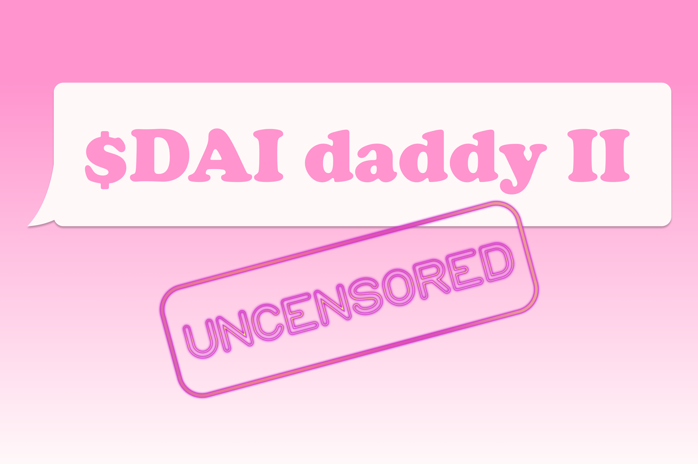
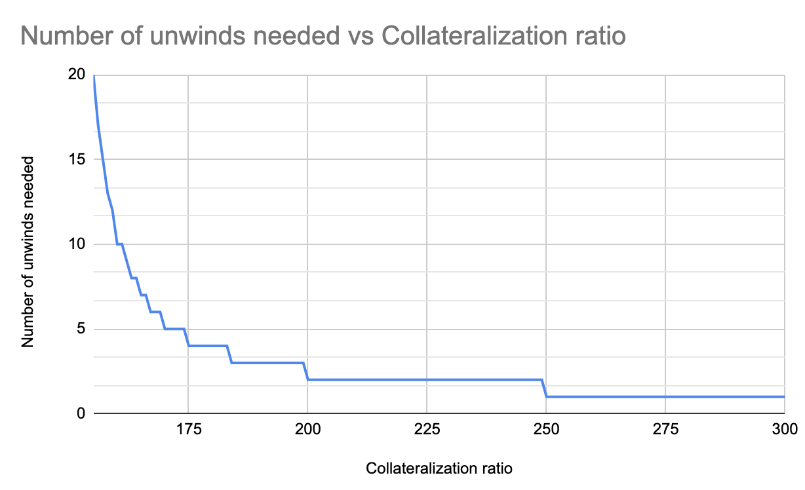
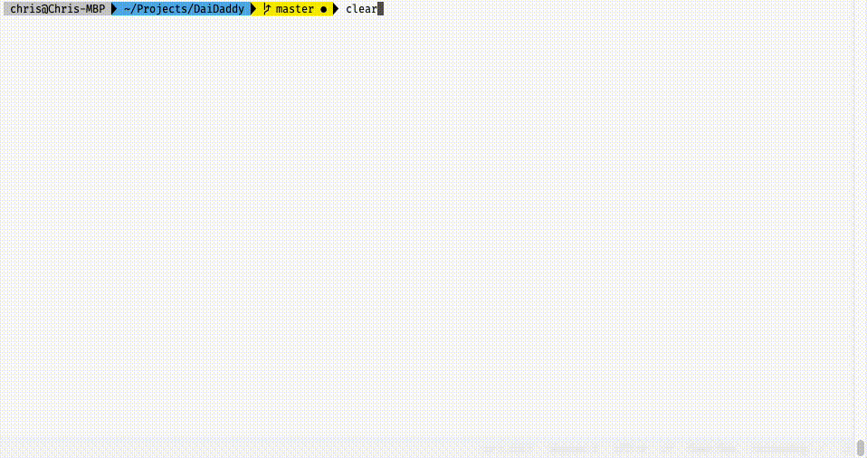

# DAI Daddy II (Uncensored)
DAI Daddy is an autonomous, open-source platform for unwinding Maker CDPs.
<br/>


<br/>

## Links
- [App Demo](https://daidaddy.xyz/)
- [Devpost](https://devpost.com/software/dai-daddy-ii-uncensored)
- [Smart Contract](XXX)

## Why DAI Daddy?
14% of Maker CDPs to date have been forcibly liquidated. When this happens, the ETH held as collateral in the CDP is automatically sold at a 3% discount to pay off the CDP holder's DAI debt, and on top of this a 13% liquidation penalty is applied.

When ETH prices drop, many CDP holders can't afford to top up their CDP with ETH to prevent liquidation; but often, they don’t have enough cash to buy DAI close their CDP. So even though they may still be collateralised at over 150% (i.e. they have sufficient assets to pay back their debt), there is no way to effectively close their CDP and pay back the debt.

How can we allow these users to close their CDP without paying a hefty liquidation fee? Introducing... DAI Daddy II (Uncensored) - an autonomous platform for unwinding Maker CDPs.

## How it Works
v2.0 of the DAI Daddy platform builds on our work with [$dai daddy](https://github.com/diffusioncon/DAI-Daddy-MakerDAO), a CDP debt marketplace where sellers can list their CDP for sale and offer a "discount rate".

The new version maintains this buy/sell functionality, but adds a new primary feature: unwinding CDPs. Under this model, rather than requiring a counterparty to ensure a CDP is repaid, the new DAI Daddy smart contract withdraws collateral from the CDP, uses [Kyber Network](https://kyber.network/) to convert this ETH to DAI, and then pays off the CDP and returns the remaining ETH collateral to the owner.

The number of withdraw/repay iterations required depends on the collateralisation ratio of the given CDP. The lower the ratio, the more iterations are required. Because this process follows an exponential curve, v1.0 of DAI Daddy is used as a backup option for CDPs whose collateralisation ratio is too low to leverage the unwinding process.

## Our Team
- 🇿🇦 Chris Maree - Financial Maths, Smart Contracts & Integrations
- 🇳🇿 Hamed Ali - Front-End
- 🇳🇿 Stefan Bachmann - Front-End
- 🇳🇿 Matthias Bachmann - UX/UI, Design
- 🇳🇿 Liesl Eichholz - UX/UI, Design

## Technical Description
For a technical Description of the Dai Daddy Debt market please see version 1 of the project [$dai daddy](https://github.com/diffusioncon/DAI-Daddy-MakerDAO). The description that follows below is specifically for the unwinding done in the Dai Daddy V2 submitted to the Kyber Hackathon.

The Dai Daddy V2 system starts with 3 transactions:
1) Prove to the Dai Daddy that you own a CDP.
2) Transfer the CDP to Dai Daddy's `Unwinder`
3) Unwind the CDP position

These are required to be done in 3 separate transactions because CDP's are not always owned by a smart contract wallet. In future versions we will integrate directly with the MakerDao dashboard proxy contract which can bundle these three tx's into one go.

Once the Dai Daddy `Unwinder` contract has ownership of the CDP it preforms the following steps when conducting an unwind:

1) Get's info on the CDP from the `tub` contract from MakerDao
2) Extracts the maximum `Weth` possible from the CDP by first calculating the amount that can be drawn and then calling `free` followed by `exit` on the `tub` contract. This acts to convert Collateral to `Peth` and then `peth` to `weth`. This `weth` can now be traded on Kyber.
3) Initiate a trade against the `kyberNetworkProxy` Contract. The trade price is calculated with the `getExpectedRate` function where we are trading from `weth` to `dai`.
4) At this point the DaiDaddy contract has dai from the drawn collateral. This is now `wipe`d from the CDP's debt to remove outstanding debt.
5) Now that debt is `wipe`d we can draw out more `peth` collateral from the CDP and convert this to `weth`. If need be this process can be repeated as many times as required to pay off all the outstanding debt.
6) Finally the freed `weth` and `dai` is sent back to the original user along with `shut`ing the CDP.

The graph below shows the number of times that `draw`, `exit`, `trade` and `wipe` need to be done to close a CDP based on the collateralization ratio of the Position. The lower the collateral in the CDP the more times this process needs to get looped to unwind the CDP.



## Smart Contract
DAI Daddy consists of one main smart contracts are rather complex because they need to integrate with a number of different moving parts and systems. DaiDaddy's main contract is called `Unwinder.sol` which is responsible for all main logic in the Dai Daddy platform. 

This contract integrates with and knows about and operates the following other contracts:
1) `KyberNetworkProxy` for trading `Weth` to `Dai`
2) `saiTub` MakerDao's sai main contract for interacting with CDPs.
3) `Medianizer` for getting latest price feeds from MakerDao
4) `ERC20` to facilitate a number of different token interactions from Dai Daddy. This includes:
   1) `Peth` for underlying collateral from the CDP
   2) `Weth` for free'ed collateral and to trade Dai with Kyber
   3) `Dai` to pay off outstanding debt.
   4) `Mkr` to pay stability fee


Testing and mocking was done by implementing the required functionality from within each of the above contracts in a contract mock. These mocks mimic the functionality of the integrated system. For example the `trade` function in kyber was mocked by creating a fake function that behaved exactly the same as the real kyber trade function but without needing to implement all the business logic of the contract. It simply accepted one token and sent back a proportional amount of the other token. 

All integrations with all the major contracts was done using Interfaces to simplify the integrations. All contracts were tested and the mocks were tested to ensure expected mocked bahvour. 



The provided migrations script deploys into a kovan. All contracts have also been deployed to the kovan test net and can be found [here](https://kovan.etherscan.io/address/0xab605771d0c8ad55fce8d52e009673c62d4ff5a3) with verified code.

## CDP unwinding mathematics
There are a number of complex calculations that are needed to be performed to unwind the CDP sussesfully. Specifically these are involved with converting from one currency to another as well as calculating how much tokens to send to each function call. Additional complexity comes from the itterative nature of the unwinding process. Lastly, Because Dai uses `weth` all computations need to consider the `weth` to `peth` to `dai` ratios when finding the exact values. An extensive back testing and model validation was performed to check the calculations used. These can be found in a spreadsheet [here](https://docs.google.com/spreadsheets/d/118z6e2dp9PFzla9QqMUGS5vI_kQx-5purT44Ut4maJM/edit?usp=sharing).

The main calculations needed in the process are finding the amount of maximum ether that can be drawn from the CDP, calculating the `freeableCollateralWeth`, the number of `unwindsNeeded` and the `collateralizationRatio`. Please check the smart contract and the spreadsheet for implementation details.

## Environment
Everything can be set up using one command within `yarn`.
```
yarn install
```

## Testing
Tests are written in javascript for the solidity tests.
```
truffle test
```

## Deployment
To run locally use:
```
truffle migrate --network development --reset
yarn serve
```

To deploy to Kovan set up a `mnomonic.js` in the root of the directory with the following structure:
```
module.exports = 'saddle ... YOUR SEE HERE ... pool';
```

Then migrate to Kovan using:
```
truffle migrate --network kovan --reset
```

## Additional Resources
- [Pitch Deck](https://docs.google.com/presentation/d/1sbFyWNFegvZEwloTaPRPvk2K4rM0HGzKscSY2kY62vo/edit?usp=sharing)
- [Figma Mockups](https://www.figma.com/file/Uxyp63OzXWIDANogDZaRgj/DAI-Daddy-Kyber-DeFi-Hackathon?node-id=0%3A1)
- [DAI Daddy v1.0](https://github.com/diffusioncon/DAI-Daddy-MakerDAO)
